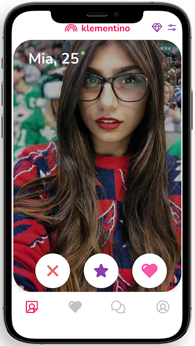

### 📖 Preface

##### 👨‍👩‍👧‍👦 People are social creatures, it's nature.
##### 📊 By statistics if one person is alone, he more prone for some deseases, more mental problems. A lot of people spends a very lot of time for finding their soulmates or just a good communication.
##### Live demo: https://klementino-5url7a94y-aksimka.vercel.app/#/likes

------------

### 📱About project

##### This project is free and open source dating app 🙎‍♂️👰‍♀️ that solves this problem and helps people to get more social interaction

------------

### Technologies

